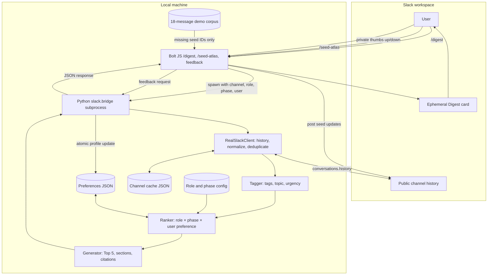
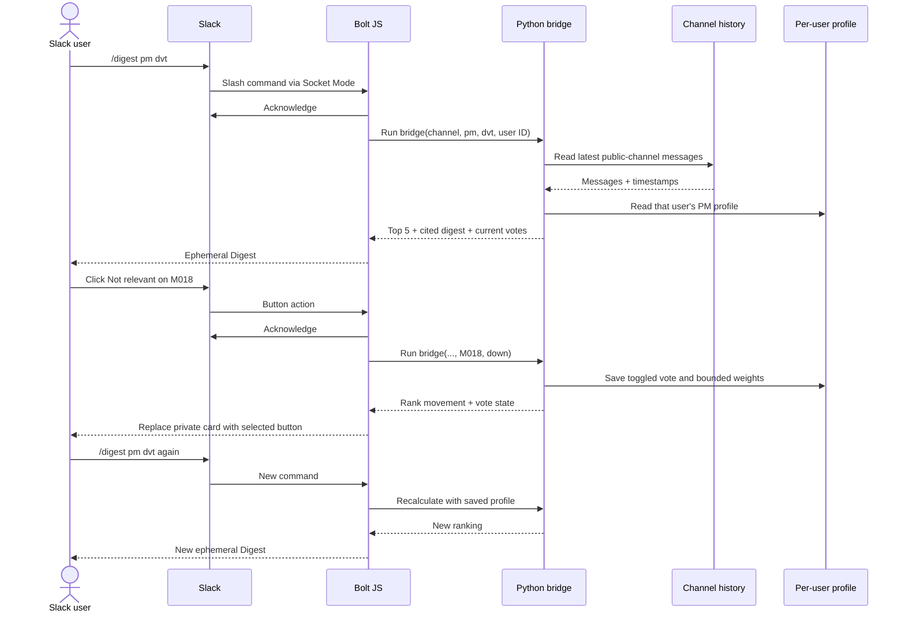

# System design

EverCurrent Digest is a **local, single-workspace prototype**. A Slack Bolt app receives slash commands and private button actions through Socket Mode. Each request launches the Python bridge, which reads the invoking channel and returns a source-cited Top 5. There is no external database, hosted API, scheduler, or LLM in the current implementation.

## Components and data flow

The JavaScript service at [`slack-app/listeners/digest-service.js`](../slack-app/listeners/digest-service.js) invokes `python3 -m slack.bridge` with `execFile`; it does not build a shell command from user input. The bridge returns JSON. The UI translates cited Markdown links into Slack-formatted links and renders per-item rating buttons.

## Request and feedback sequence

## State and boundaries

- **Source:** `RealSlackClient` calls Slack `conversations.history` with the bot token, reads up to the newest 100 messages, and retries failed reads twice. It excludes earlier Digest output to avoid self-summarization. Seeded `[M001]`-style IDs are deduplicated; ordinary messages get stable timestamp-based `S...` IDs and Slack permalinks.
- **Fallback:** A successful read atomically updates the per-channel JSON cache. If Slack later fails, the bridge uses cached messages and clearly prefixes the output with `⚠️ STALE DATA`. Without a cache, it fails instead of inventing a result.
- **Personalization:** Profiles are keyed by `Slack user ID:role`; votes change only that user's role profile. Slack feedback is private and stored in ignored `data/runtime/preferences.json`. Role and phase defaults are committed configuration files. Prior votes are migrated to current weights once, without discarding the vote.
- **Presentation:** The Top 5 is computed **before** section grouping. A message's `#rank` is its overall score position; display sections such as Critical and Schedule are grouping labels, not separate ranking pools. The cited text is copied from the source message, and each live citation links back to it.
- **Security/scope:** Tokens come from the Slack CLI environment or local `.env`, not the repository. The current manifest requests `channels:history`, `chat:write`, and `commands`; the runbook therefore uses a public channel with the app invited. The JSON store is local and not appropriate for concurrent production workers.

## Design choices and limitations

| Choice | Why | Limit |
| --- | --- | --- |
| Deterministic rules instead of an LLM | Easy to explain, reproduce, and check for exact-source faithfulness. | Cannot paraphrase or infer facts across messages. |
| Strongest tag score | One message with several tags is not rewarded simply for matching more keywords. | Secondary tags can still change the winning tag after feedback. |
| Item + specific topic + tiny broad-tag feedback | Makes one vote visible without suppressing a whole category. | Repeated votes accumulate; this is not a learned semantic model. |
| Ephemeral Digest and ratings | Feedback stays personal; colleagues do not see a negative rating on their message. | An ephemeral card is not a shared team artifact. |
| Local JSON persistence | Simple, auditable demo state. | Replace with a transactional store for multiple workers/users at scale. |

The implementation of the scoring and feedback bounds is documented in [Algorithm](ALGORITHM.md). The executable setup and Slack demo are in [Runbook](RUNBOOK.md).
